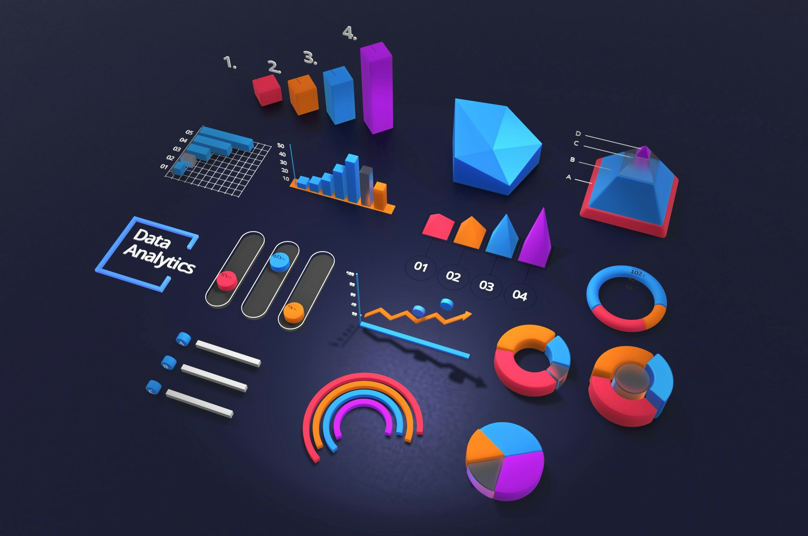

###  Hi there 👋, Welcome to my GitHub 😄
#### Data Science, AI, ML 💻
![Data Science, AI, ML 💻]

♡･ᴗ･`♡  I'm Shivani Agrawal from India  ♡･ᴗ･`♡  
✩ I really enjoying learning new things💫🦋🧿

#### Skills
* Data Analytics - Excel , SQL , Python (Pandas , Numpy)
* Visualization - Excel, Python (Matplotlib)
* Programming - Python
* Interest - Agentic AI, Generative AI, Traditional ML, Data Analysis

◠🌱 I’m currently learning Data Science, Machine Leaning, AI, Python and data structure  
◠💻ğŸ€ğŸ“š Pursuing Data Science and Analytics course in Imarticus Learning  
◠📫 How to reach me: 📧 shivania812@gmail.com  
â— âš¡ More About Me :    &#160; 🦠Anime lover ( First anime - Death note , Favorite anime - Naruto )   &#160; ♟ Chess player (Beginner) Wanna play-> https://www.chess.com/member/shivani_2006    &#160; 🨠Love doing Art & Craft   &#160; 🪈Flute learner   &#160; ğŸ Cricket Lover 

   

